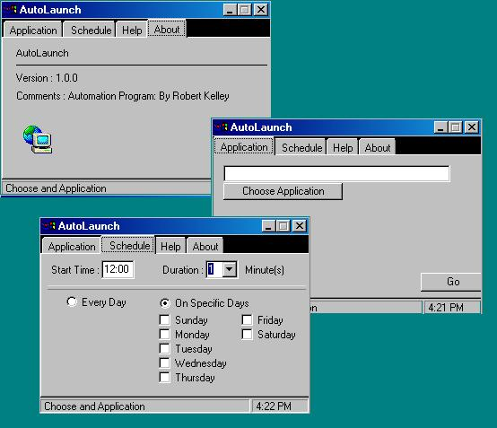



## Auto Application Launch/stop

### Description

This will allow you to schedule an abblication to launch at a select time and then stop. It was designed to run Ms access reports that connect to an Oracle database, run a macro to print the reports and disconnect.
 
### More Info
 
time and Durations you want the application to run

             |
---                |---
**Submitted On**   |2002-02-27 16:16:48
**By**             |[Robert Kelley](https://github.com/Planet-Source-Code/PSCIndex/blob/master/ByAuthor/robert-kelley.md)
**Level**          |Intermediate
**User Rating**    |4.4 (40 globes from 9 users)
**Compatibility**  |VB 5\.0, VB 6\.0
**Category**       |[Complete Applications](https://github.com/Planet-Source-Code/PSCIndex/blob/master/ByCategory/complete-applications__1-27.md)
**World**          |[Visual Basic](https://github.com/Planet-Source-Code/PSCIndex/blob/master/ByWorld/visual-basic.md)
**Archive File**   |[Auto\_Appli581192272002\.zip](https://github.com/Planet-Source-Code/robert-kelley-auto-application-launch-stop__1-32165/archive/master.zip)

